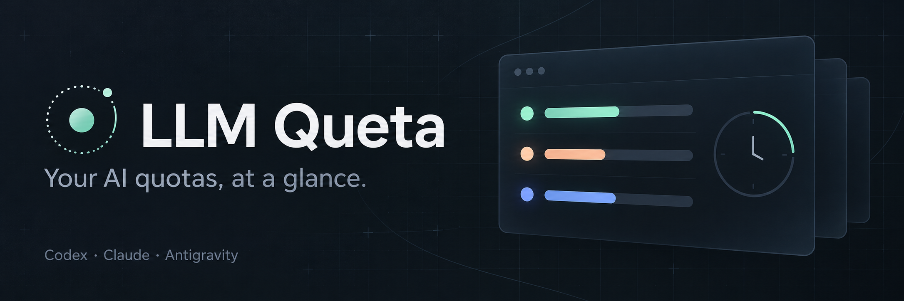

# LLM Queta

A Flutter desktop overlay for Codex, Claude, and Antigravity subscription quotas. It displays multiple account profiles together with remaining percentages, reset countdowns, subscription plans, reported token usage, available credit balances, observation age, and connection status. Sample values appear only in the explicitly selected demo mode.

## Build and run

Developed with Flutter 3.47.6 and Dart 3.13.5. Install the Flutter stable SDK and the native desktop toolchain for the target operating system.

```sh
flutter pub get
flutter analyze
flutter test
flutter run -d macos
```

Use `-d windows` or `-d linux` on those operating systems. Create a release with `flutter build macos`, `flutter build windows`, or `flutter build linux` on the matching host. Launch the executable with `--demo` to preview sample data without provider access. The settings menu can also toggle demo mode.

Run the native window integration test with `flutter test integration_test/desktop_test.dart -d macos`, replacing the device on Windows or Linux. The test uses demo data and checks pinning, opacity, and window size. `.github/workflows/desktop.yml` defines unit tests and release builds for all three operating systems; adding the workflow does not mean those hosted jobs have run.

The macOS build disables App Sandbox because it launches the installed Codex CLI, discovers the user's Antigravity process, and reads the shared Claude snapshot and retained local token-usage records. It is intended for direct desktop distribution, not the Mac App Store sandbox. Release signing and notarization require the distributor's Apple credentials and are not configured here.

## Data connections

Run `dart run tool/check_providers.dart` to check local integration status without printing credentials or quota percentages. The command queries the registered accounts and identifies results by their one-based position in the account list without printing account labels or connection paths.

| Provider | Data source | Requirements |
| --- | --- | --- |
| Codex | Official `codex app-server` `account/rateLimits/read` RPC | Installed Codex CLI signed in with a ChatGPT account. Set `LLMQUETA_CODEX_EXECUTABLE` if the executable is outside the app's PATH. |
| Claude | Claude Code `statusLine` JSON and retained local transcripts | Configure the included bridge for quotas and active-session identification. Token totals use local history. |
| Antigravity | Local Language Server quota RPC | A running Antigravity instance. This internal protocol can change independently of this app. |

Queta never treats missing quota as zero usage. A reset countdown reaching zero does not restore the displayed allowance: the display waits for a new provider observation. Observations older than ten minutes are marked stale. Provider failures retain previous measurements with a stale indicator when available.

### Multiple accounts

Open **Manage accounts** from the settings menu or the empty connection screen. Add an account label and its connection settings. Connected profiles appear simultaneously in the normal overlay and HUD, including multiple profiles from the same provider. The manager also lists disconnected profiles. Edit a profile to rename it or change its connection; remove it to stop displaying it. Removal does not sign out of the provider or delete credentials.

The initial **Default** profile for each provider keeps the existing environment and local discovery behavior. Added profiles use separate connection settings:

| Provider | Account settings | Preparation |
| --- | --- | --- |
| Codex | Absolute Codex home directory | Sign in to Codex with `CODEX_HOME` set to that directory. Use a different directory for each account. |
| Claude | Absolute Claude configuration directory and a separate snapshot file | Sign in with `CLAUDE_CONFIG_DIR` set to that directory. Configure that account's statusline bridge with `--snapshot` pointing to its snapshot file. |
| Antigravity | Explicit loopback URL and optional CSRF environment variable name | Run the corresponding signed-in instance. Set the named variable to that instance's CSRF token in the environment that launches Queta. |

For example, on macOS or Linux, prepare a separate Codex or Claude login with:

```sh
CODEX_HOME="$HOME/.codex-work" codex login
CLAUDE_CONFIG_DIR="$HOME/.claude-work" claude auth login
```

On PowerShell, set `$env:CODEX_HOME` or `$env:CLAUDE_CONFIG_DIR` before running the corresponding login command. Enter the resulting absolute directory path in Queta; fields do not expand `~` or shell variables. Codex uses its configured home for [credential storage](https://learn.chatgpt.com/docs/auth). Claude documents [separate account logins using `CLAUDE_CONFIG_DIR`](https://code.claude.com/docs/en/authentication#log-in-with-multiple-accounts).

For the additional Claude account, merge this property into that account's settings, replacing both paths:

```json
{
  "statusLine": {
    "type": "command",
    "command": "\"/absolute/path/to/claude_statusline\" --snapshot \"/absolute/path/to/claude-work.json\""
  }
}
```

Use the same snapshot path in Queta. Each account needs its own configuration directory and snapshot file to keep retained token history and quota observations separate. Recompile the bridge after updating it to use the `--snapshot` option.

Custom Codex profiles do not inherit the default account's selected thread ID, so their session token total remains unavailable. Custom Codex and Claude profiles exclude inherited API-token overrides that could select a different account. Antigravity profiles store an environment variable name rather than the token value; update the endpoint and environment when that instance restarts. Profiles refer to existing provider logins and do not perform login or account switching inside Queta.

Profile metadata is saved in `accounts.json` alongside `preferences.json`: `~/Library/Application Support/llmqueta` on macOS, `%APPDATA%/llmqueta` on Windows, and `$XDG_CONFIG_HOME/llmqueta` or `~/.config/llmqueta` on Linux. The file contains labels and connection locations, not copied provider credentials. An unreadable or invalid account file is preserved and blocks profile writes; repair the file and restart the app. A refresh failure retains only that account's previous data. Changing a connection or deleting a profile discards its old observation.

### Codex executable

Codex executable discovery checks PATH and common user install locations. On Windows, use native `codex.exe`; `.cmd`, `.bat`, and `.ps1` shell wrappers are not executed. Set `LLMQUETA_CODEX_EXECUTABLE` to the native binary when needed. An explicit override is authoritative and does not fall back to a different installation.

### Claude statusline bridge

Compile the standalone bridge with the Dart SDK included in Flutter:

```sh
mkdir -p build
dart compile exe tool/claude_statusline.dart -o build/claude_statusline
```

On Windows PowerShell, create the output directory with `New-Item -ItemType Directory -Force build` and use an output path ending in `.exe`. Add the following `statusLine` property to the existing Claude Code settings object, using the absolute executable path on the local machine:

```json
{
  "statusLine": {
    "type": "command",
    "command": "\"/absolute/path/to/llmqueta/build/claude_statusline\""
  }
}
```

Merge this property into existing settings rather than replacing the file. If another statusline command is already configured, integrate both commands with a wrapper that supplies the same stdin JSON to each. Queta does not modify Claude settings automatically.

The bridge stores the supported quota windows, observation timestamp, session identifier, and absolute transcript path when provided. It does not copy conversation content or credentials. The app reads usage counters from retained JSONL files under `~/.claude/projects`, or `$CLAUDE_CONFIG_DIR/projects`, and does not transmit those files. The stored transcript path identifies the active session only when it matches a file within that history directory. It prints a short Claude quota status so it can also serve as the terminal statusline. Recompile the bridge after updating it to supply session metadata.

| Platform | Snapshot |
| --- | --- |
| macOS | `~/Library/Application Support/llmqueta/claude.json` |
| Windows | `%APPDATA%/llmqueta/claude.json` |
| Linux | `$XDG_CONFIG_HOME/llmqueta/claude.json`, or `~/.config/llmqueta/claude.json` |

### Antigravity endpoint override

Queta first looks for the running Antigravity Language Server and its process-owned listening ports. On macOS and Linux it uses `ps` and `lsof`; an advertised extension-server port is a fallback when listener discovery is unavailable. On Windows it uses PowerShell process and TCP connection queries. Discovery reads the matching process's CSRF flag in memory and does not save it.

For an explicitly configured local server, set `LLMQUETA_ANTIGRAVITY_URL` to its HTTP(S) origin, such as `https://127.0.0.1:42100`, and `LLMQUETA_ANTIGRAVITY_CSRF_TOKEN` to the token of that same running Language Server process. Ports and tokens can change when Antigravity restarts. Do not commit token values or paste them into issue reports.

Only literal loopback addresses with an explicit port are accepted. Redirects are disabled. Self-signed certificates are accepted only for that configured loopback endpoint. Queta requests `RetrieveUserQuotaSummary` and uses `GetUserStatus` for account plan metadata or as a fallback on older servers. If a response has no reset timestamp, the app displays that the time is unavailable.

## Interface

Service headers show the reported subscription plan when available in both window and HUD modes. Codex uses the quota response's `planType`. Claude uses the optional `claude auth status --json` lookup; set `LLMQUETA_CLAUDE_EXECUTABLE` when the native CLI is not discoverable. Antigravity uses `GetUserStatus` account plan metadata from its internal local protocol. Missing or failed plan lookups leave the quota visible without a plan label. Model names and usage limits are not used to infer a subscription. The Claude `subscriptionType` field was checked against CLI 2.1.285; older or changed CLI versions may omit it. Antigravity plan metadata uses an internal protocol and may change between releases.

- Select **HUD mode** in the settings menu for a small, undecorated panel. HUD always stays on top and caps opacity at 90%; it preserves the normal window's settings for restoration. Drag its header to move it. Use the expand button or press Escape while the HUD has focus to return to the normal window. The close button remains accessible.
- The HUD choice is saved when changed through the UI. Launch with `--hud` to start in HUD mode without changing the saved choice. For example: `open build/macos/Build/Products/Release/llmqueta.app --args --hud` after closing an existing instance.
- Providers with reported quota windows, token counts, or credit data appear. Unavailable providers stay hidden; an empty state links to setup when no provider is connected. Previously connected providers retain their last observation with a stale indicator during transient errors.
- macOS uses its native title bar and traffic-light controls in a separate area above the Flutter content. Other desktop platforms use the in-app close button.
- Window height adapts to the visible quota, token, and credit rows, with scrolling for longer lists.
- Drag the title area to move the overlay.
- Pin or unpin it using the pin button.
- Use settings for compact view, opacity, demo data, and connection help.
- Refresh manually with the refresh button or Ctrl/Cmd+R. Automatic refresh runs every 60 seconds.
- Hover over a reset countdown to see the local reset timestamp.

Window behavior on Linux depends on the window manager and compositor. In particular, Wayland may restrict window positioning and always-on-top requests. Windows and Linux require builds and runtime verification on their respective operating systems.

## Token usage and credits

Every visible provider has today, session, and cumulative token rows in normal, compact, and HUD modes. Missing measurements show `Unavailable`, not zero. Large counts use K/M/B; hover over a row for the exact total, available input/output/cache breakdown, and source notes. Cached input is already included in input tokens and is not added again.

| Provider | Today | Session | Cumulative |
| --- | --- | --- | --- |
| Codex | Account `dailyUsageBuckets` entry matching the local calendar date; a missing or delayed bucket stays unavailable. The provider does not specify its bucket timezone. | Estimated thread usage when `LLMQUETA_CODEX_THREAD_ID` or inherited `CODEX_THREAD_ID` identifies the thread. | Account `summary.lifetimeTokens`. |
| Claude | Usage in retained local history since local midnight. | The session identified by the latest statusline bridge observation. | `Local total`: retained local history, including nested agent logs, not account-wide lifetime usage. |
| Antigravity | Unavailable through the current integration. | Unavailable through the current integration. | Unavailable through the current integration. |

Codex token activity uses `account/usage/read`, verified with CLI 0.160.1. Session queries use its experimental thread parameter; older versions or unavailable billing routes may omit the result. To select a session when launching the app directly, set `LLMQUETA_CODEX_THREAD_ID` to its thread ID. The app does not assume that the most recently updated thread is the current session. Account totals may include activity beyond the thread selected here.

Claude totals use API-message usage records, deduplicated by message ID. They include cache-read and cache-creation input tokens. Statusline context-window occupancy is not summed as session usage. Deleted or unrecorded transcripts are outside the local total. Unreadable, malformed, or oversized history makes totals unavailable rather than displaying a partial sum; scans are limited to 64 MiB per file, 256 MiB overall, and 10,000 files.

When Codex returns `credits`, the app displays its balance as whole credits, truncating fractional digits, or its unlimited state. The exact reported balance remains available in the tooltip. An availability flag without a balance is shown as available without inventing an amount. `Reset credits` is a separate count of earned rate-limit resets, not a currency balance. No credits are spent or redeemed. Claude and Antigravity credit balances are not exposed by the current adapters; quota percentages and cost fields are not converted into credits or tokens.

## Packaging

[Desktop packaging](docs/packaging.md) covers macOS DMG/ZIP and Linux DEB, RPM, Arch and AppImage builds for x86_64 and aarch64. GitHub Actions validates pushes and pull requests, then builds and uploads packages with SHA-256 checksums after validation succeeds. Both workflows support manual runs. RISC-V is not supported by the current Flutter desktop engine.

## Sources

- [Codex App Server protocol](https://learn.chatgpt.com/docs/app-server)
- [Claude Code statusline data](https://code.claude.com/docs/en/statusline)
- [Claude Code authentication status command](https://code.claude.com/docs/en/cli-reference)
- [Antigravity account metadata observed by OpenTokenUsage](https://github.com/PowerUserZ/OpenTokenUsage/blob/main/docs/providers/antigravity.md)
- [Antigravity quota UI](https://www.antigravity.google/docs/cli/commands/usage/)
- [CodexBar Antigravity protocol implementation](https://github.com/steipete/CodexBar/blob/main/Sources/CodexBarCore/Providers/Antigravity/AntigravityStatusProbe.swift)

The Antigravity adapter uses an internal protocol described by an independent open-source implementation. It is not an official Google integration. Parser fixtures and local transport tests do not establish real-account quota accuracy.

## License

This project is released under the [Unlicense](LICENSE).
Third-party dependencies remain subject to their respective licenses.

## AI-Generated Code Notice

Parts of this project were created with assistance from AI tools (e.g. large language models). All AI-assisted contributions were reviewed and adapted by maintainers before inclusion. If you need provenance for specific changes, please refer to the Git history and commit messages.
